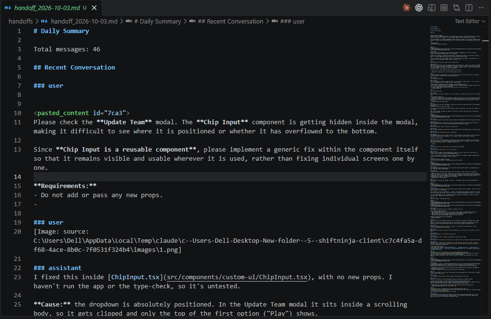
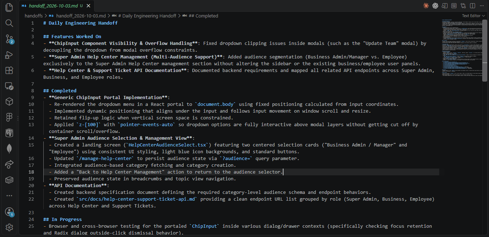
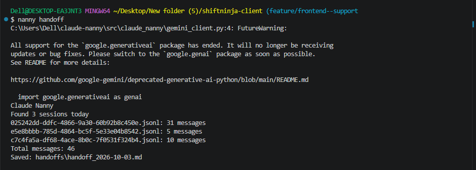

# Claude Nanny 

Automatically generate engineering handoffs and summaries from Claude Code sessions.

Claude Nanny reads Claude Code conversation history, aggregates work across multiple sessions, and produces structured markdown summaries for developers.

---

## Features

- Automatically discovers the latest active Claude Code project
-  Reads all Claude sessions for the current day
-  Merges multiple sessions into a single timeline
- Generates local summaries (no AI required)
- Generates AI-powered engineering handoffs using Gemini
- Exports markdown files for documentation and knowledge transfer
- Simple CLI workflow

---

##  Example Usage

### Generate a local summary

```bash
nanny summary
```

Output:

```text
Claude Nanny
Found 2 sessions today
025242dd-ddfc-4866-9a30-60b92b8c450e.jsonl: 31 messages
c7c4fa5a-df68-4ace-8b0c-7f0531f324b4.jsonl: 10 messages
Total messages: 41
Saved: handoffs/handoff_2026-10-03.md
```



---

### Generate an AI handoff

```bash
nanny handoff
```

Output:

```text
Claude Nanny
Found 2 sessions today
Total messages: 41
Saved: handoffs/handoff_2026-10-03.md
```



---

## Example Generated Handoff

```md
# Daily Engineering Handoff

## Features Worked On

- Help Center Management
- Audience Selection Flow

## Completed

- Added Super Admin landing page
- Improved Help Center navigation
- Refined UI alignment and spacing

## In Progress

- API integration planning

## Next Steps

- Backend API updates
- End-to-end testing
```

---

## Architecture

```text
Claude Code Sessions
        │
        ▼
 Session Discovery
        │
        ▼
  Session Reader
        │
        ▼
 Message Aggregator
        │
 ┌──────┴──────┐
 ▼             ▼
Summary     Handoff
(Local)     (Gemini)
 │             │
 ▼             ▼
Markdown Output Files
```

---

## Project Structure

```text
claude-nanny/
├── src/
│   └── claude_nanny/
│       ├── discovery.py
│       ├── reader.py
│       ├── models.py
│       ├── summary_generator.py
│       ├── handoff_generator.py
│       ├── gemini_client.py
│       ├── file_writer.py
│       └── __main__.py
│
├── handoffs/
│   └── handoff_YYYY-MM-DD.md
│
└── README.md
```

---

## Why I Built This

While working with Claude Code across multiple sessions, it becomes difficult to:

- Track completed work
- Remember design decisions
- Create end-of-day handoffs
- Resume work after context compaction

Claude Nanny solves this by converting Claude Code conversations into structured documentation automatically.

---

## Screenshots

### CLI



### Generated Summary


### Generated Handoff


---

## Author

Built as a developer productivity tool to automate engineering summaries and handoffs from Claude Code sessions.
